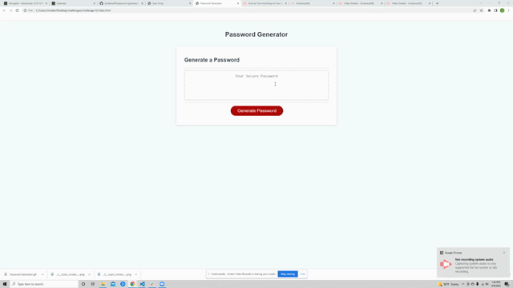

# Challenge-3 Password Generator

## **Description**

This project asked that I build a random password generator.

1. First I set up a variable containing all of the character options from which the user can choose.

2. Next I started to define the generatePassword function.

    1. I created a variable passwordCharacters that would alow me to insert the character options they selected via if statements

    2. I then created a prompt for the length of their password. this contained a parseInt to return an integer instead of a string.

    3. Within that I made and if/else statement to validate whether or not they chose a valid length. If not it sent them back to the start.

    4. I included the character usage confirms inside the if statement so they would only run if the user selected a valid length.

    5. For each character confirm I used an if statement that would include the selected characters in the passwordCharacters variable if they were confirmed

    6. Then I added an if statement to make sure the user did confirm at least one character type to use. If they didn't it starts the function over.

    7. Next I created an else statement which will add the password variable which will include the passwordCharacters and math random within a for loop to to generate a password with the given criteria.

    8. Finally I return the password to display it in the password box

## **Screenshot**

## **Link to Page and Repository**

1. Page: https://jordanio49.github.io/password-generator-challenge/

2. Repository: https://github.com/Jordanio49/password-generator-challenge